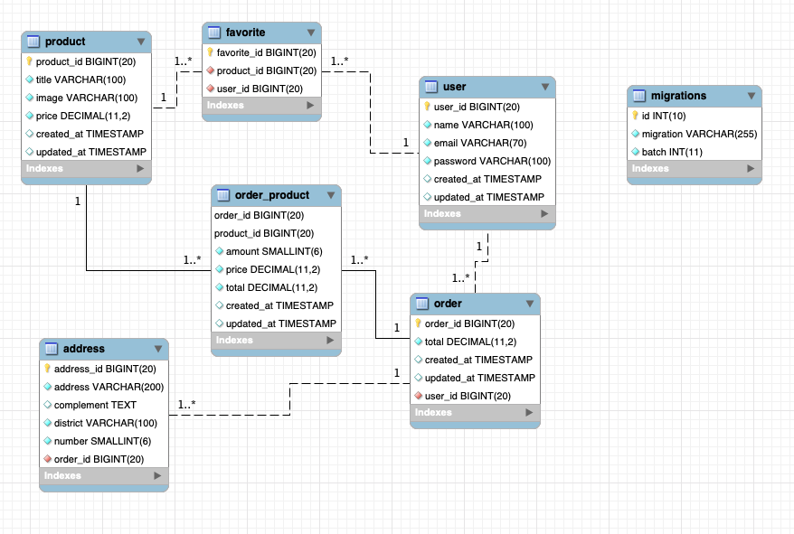
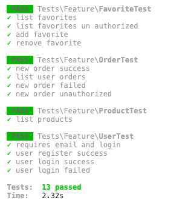

[](https://pizzaclub-api.herokuapp.com/)
[](https://pizzaclub.herokuapp.com/)

# THE PIZZA TASK

It's a Project to manage pizza orders.

#### API (Backend) 
URL: https://pizzaclub-api.herokuapp.com/

#### Frontend URL: 
https://pizzaclub.herokuapp.com/


## Getting Started

These instructions will get you a copy of the project up and running on your local machine for development and testing purposes. See deployment for notes on how to deploy the project on a live system.

### Prerequisites

This project is separate in `backend` and `frontend`. After clone this you'll need to have installed:
- Node
- PHP >7.3
- Composer
- MySQL >5.7

### Installing

#### Backend:

First of all, you need to setup the DATA BASE's data in your `.env` file, like:
```
DB_CONNECTION=mysql
DB_HOST=127.0.0.1
DB_PORT=3306
DB_DATABASE=pizza
DB_USERNAME=root
DB_PASSWORD=
```
* Make sure the database was created.

Run at terminal: 

```$ cd backend```

```$ composer install```

```$ php artisan migrate```

```$ php artisan db:seed```

```$ php artisan jwt:secret```

```$ php artisan storage:link```

```$ php artisan serve```

Check your database. It should be something like:


#### Frontend:
Run at terminal:

```cd frontend```

```npm install``` or ```yarn```

```npm start``` or ```yarn start```

You can add `API_ROOT` and `STORAGE_ROOT` in your frontend `.env` file to set the API URL and/or the image's folder.


## Running the tests

### Backend:
Run at terminal:
```php artisan test```



### Frontend:


## Built With

* [Laravel 7](https://laravel.com/docs/7.x) - The backend framework used
* [Composer](https://getcomposer.org/) - Dependency Management
* [React](https://reactjs.org/) - The frontend framework user


## Authors

* **Eder Taveira** - *All* - [EderTaveira](https://github.com/edertaveira)


